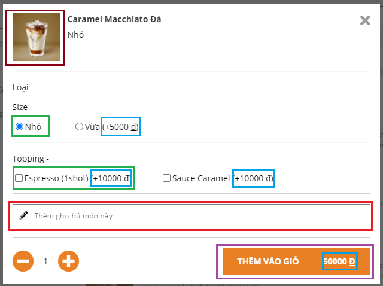

# React Order Coffee

## Bước 1: Chia khối:

1. Root Container: Chứa toàn bộ nội dung trang web
2. Header (nâu): Chứa phần đầu trang web
3. Body (đen): Chứa nội dung trang web
4. Footer (đỏ): Chứa phần cuối trang web
5. MainContainer (nâu đỏ): Chứa List Category và List Product
6. CartContainer (xanh xám): Chứa thông tin giỏ hàng.
7. List Categories (xanh lá đậm): Chứa các Item Category
8. List Product (đỏ): Chứa form tìm kiếm và list sản phẩm theo loại category
9. Item Category (xanh lá non): Thông tin loại sản phẩm
10. Item Product (xanh biển): thông tin sản phẩm cụ thể.
11. Image (xám): Ảnh
12. Button (vàng): nút button
13. Input (hồng): thanh input.
14. Price(xanh lơ): giá tiền

## => Phân cấp thành phần:

- Root
  - Header:
    - Logo
    - Ship Form
    - Button Login
  - Body
    - MainContainer
      - List Categories
        - Item Category
      - List Product
        - Search Form
        - Item Product
          - Image
          - Price
    - CartContainer
      - Button
      - Discount Form
      - Price
  - Footer

## Bước 2: Xây dựng bản tĩnh:

- Code các thành phần
- Ráp các thành phần với dữ liệu tự nhập

## Bước 3: Xác định trạng thái hoàn chỉnh tối ưu nhất cho giao diện người dùng:

- Rút gọn code bằng việc đưa props vào các component.
- Xác định các state tối thiểu.

## Bước 4: Đưa state vào đâu:

- Fetch API và đẩy dữ liệu vào các component.
- Lựa chọn chô nào giữ state, chỗ nào lấy dữ liệu.

---

## 14-06-21 đến 26-06-21

## 1. Fix filter none data:

- Ban đầu, ta có mảng chứa các listProduct theo category.
- Sau đó, filter theo keyword thì được kết quả là các listProduct .(có thể null và [])
- Ta map mảng đó và chỉ lấy các listProduct != null.
- Đặt một biến kiểm tra nếu đi qua các mảng mà không có listProduct nào có sản phẩm thì nó là false, ngược lại là true.
- False thì show none data. True thì show sản phẩm search được.

## 2. Inside Search Input Address:

- Em dùng onClick và onBlur rồi setTimeOut cho nó để nó bắt dữ liệu khi nơi listAddress lên lại value thẻ input
- Dùng debounce để chỉ fetch API sau khi điền xong keyword.

## 3. Timer Order:

- Tạo các state kiểm soát đóng mở phần "hẹn giờ giao hàng".
- Dùng createRef của react để check inside block đó không để setState đóng mở.
- Khởi tạo giá trị thời gian giao hàng(7:30 - 20:30) bằng đối tượng Date().
- Lấy 3 ngày liên tục (hôm nay-mai-mốt) theo giá trị ngày hiện tại.
- Lấy giờ hiện tại và suy luận logic để show option timer cho đúng ( nếu ngoài giờ đóng cửa thì setState sang ngày mai).
- Option timer mai và mốt thì sẽ chạy vòng for và bước nhảy 30 phút.

## 4. Cart Order:

- Chia khối như hình, tận dụng lại các component có sẵn như Image, Price, Input, Button.
- Lúc click sản phẩm thì lấy dữ liệu và load lên component Order, khởi tạo các giá trị radio và amount, price ...
- Khi chọn thì sẽ setState lại.
- Nhấn Thêm vào giỏ sẽ lưu giá trị vào 1 list với những thông tin chủ yếu: id của sản phẩm, size, topping, price, price topping, amount, description.
- Lưu lên locaStorage để khi load ko bị mất dữ liệu.
- Khi nhấn chỉnh sửa từ giỏ hàng thì sẽ lấy dữ liệu sản phẩm đó rồi hiện lên bên cpn Order.( thực hiện xóa sản phẩm đó và add mới thay vì chỉnh sửa)

## Khó khăn:

- Address API thay đổi nên sau khi anh gửi mới fix được.
- Sử dụng Ref còn vụng, sau nhiều lần mày mò mới hiểu được cách dùng và ý nghĩa của nó.
- Filter none data khá mất thời gian và thành quả là suy nghĩ được 2 cách ( 1:lấy list menu khi fetch ở lần 1 và thực hiện filter đc kết quả trực tiếp; 2: thực hiện filter theo list chứa category)
- Làm quen với đối tượng Date nên tìm hiểu khá nhiều thông tin mới lấy được nội dung mình mong muốn. Logic nhập nhằng khá bối rối. Tự nhận thấy cách viết code logic ở phần Timer này chưa tối ưu.
- Order và CartOrder làm 2 lần nhưng vẫn thấy đặt state chưa ổn thỏa lắm. Suy nghĩ cái topping hơi sai lệch nên cần sự giúp đỡ của anh.
